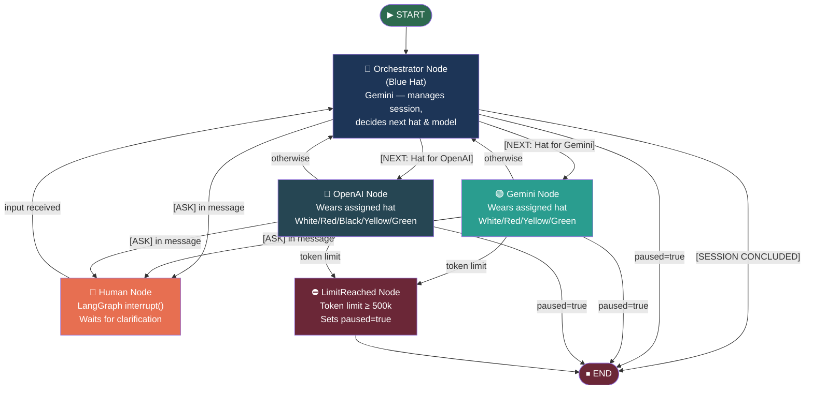

```mermaid
flowchart TD
    START([▶ START]) --> Orchestrator

    Orchestrator["🎩 Orchestrator Node\n(Blue Hat)\nGemini — manages session,\ndecides next hat & model"]

    Gemini["🟢 Gemini Node\nWears assigned hat\nWhite/Red/Yellow/Green"]

    OpenAI["🔵 OpenAI Node\nWears assigned hat\nWhite/Red/Black/Yellow/Green"]

    Human["👤 Human Node\nLangGraph interrupt()\nWaits for clarification"]

    LimitReached["⛔ LimitReached Node\nToken limit ≥ 500k\nSets paused=true"]

    END([⏹ END])

    %% Main flow from START
    Orchestrator -->|"[NEXT: Hat for Gemini]"| Gemini
    Orchestrator -->|"[NEXT: Hat for OpenAI]"| OpenAI
    Orchestrator -->|"[SESSION CONCLUDED]"| END
    Orchestrator -->|"[ASK] in message"| Human
    Orchestrator -->|"paused=true"| END

    Gemini -->|"[ASK] in message"| Human
    Gemini -->|"otherwise"| Orchestrator
    Gemini -->|"paused=true"| END
    Gemini -->|"token limit"| LimitReached

    OpenAI -->|"[ASK] in message"| Human
    OpenAI -->|"otherwise"| Orchestrator
    OpenAI -->|"paused=true"| END
    OpenAI -->|"token limit"| LimitReached

    Human -->|"input received"| Orchestrator

    LimitReached --> END

    %% Styling
    style START fill:#2d6a4f,color:#fff
    style END fill:#6b2737,color:#fff
    style Orchestrator fill:#1d3557,color:#fff
    style Gemini fill:#2a9d8f,color:#fff
    style OpenAI fill:#264653,color:#fff
    style Human fill:#e76f51,color:#fff
    style LimitReached fill:#6b2737,color:#fff
```
