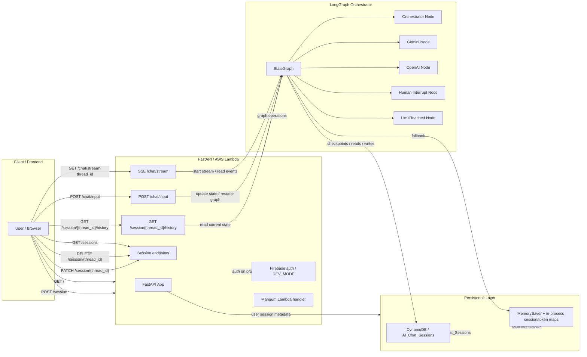

# Backend Architecture

This document describes the `web_app/backend/` architecture for the Nebula Glass AI chat service.

## Public Backend APIs

- `GET /` — health check; returns `API_VERSION`.
- `POST /session` — accept/initialize a session by `thread_id`.
- `GET /session/{thread_id}/history` — return current graph state for a session.
- `GET /sessions` — list sessions for authenticated user.
- `DELETE /session/{thread_id}` — delete session metadata for authenticated user.
- `PATCH /session/{thread_id}` — update session metadata (e.g. `session_name`).
- `GET /chat/stream?thread_id=...` — server-sent events stream for graph execution updates.
- `POST /chat/input` — send seed topic, human content, or paused/unpaused state.

## Backend Components

- `FastAPI` hosts the HTTP API and SSE endpoint.
- `Mangum` wraps the FastAPI app for AWS Lambda deployment.
- `LangGraph` `StateGraph` implements orchestration logic.
- `DynamoDBSaver` persists checkpoints and optional metadata when DynamoDB is enabled.
- Local fallback uses `MemorySaver` and in-memory session/token maps.
- Firebase is used for auth on protected endpoints, with `DEV_MODE` bypass.

## State and Routing

The LangGraph state includes:

- `messages`: append-only list of `{ role, content }` entries.
- `paused`: boolean to stop/resume execution.
- `is_asking`: whether the last AI output contains `[ASK]`.
- `user_id`: optional user identity.
- `session_name`: human-readable session title.
- `current_hat`: current thinking hat context for model nodes.

Graph nodes:

- `Orchestrator` — decides which model should act next.
- `Gemini` — Google GenAI node.
- `OpenAI` — OpenAI chat completion node.
- `Human` — interrupt/waiting-for-clarification node.
- `LimitReached` — emits an error and pauses when token limits are hit.

Router logic:

- `paused == True` → `END`
- `last_msg.role == System` → `END`
- `[ASK]` in last message → `Human`
- `[SESSION CONCLUDED]` → `END`
- `last_msg.role == Human` → `Orchestrator`
- `last_msg.role == Orchestrator` → route to Gemini or OpenAI based on orchestrator decision
- otherwise → `Orchestrator`

## Database / Persistence Level

When DynamoDB is enabled (`USE_DYNAMODB` or Lambda environment), the backend uses table `AI_Chat_Sessions`.

- Primary key: `thread_id`
- Sort key: `checkpoint_id`
- Checkpoint records store serialized LangGraph state and metadata.
- `type == checkpoint` is used to filter actual graph checkpoints.
- Writes are stored with `item_type == write` and prefixed checkpoint IDs.

Additional DynamoDB metadata items:

- User token counters: `thread_id = user_tokens#{user_id}`, `checkpoint_id = tokens`
- Session metadata: `thread_id = user_sessions#{user_id}`, `checkpoint_id = session#{thread_id}`

Local fallback stores the same logical data in Python process memory.

## Mermaid Architecture Diagram

## Notes

- The SSE stream is unauthenticated today because `EventSource` cannot send auth headers, while POST routes are protected.
- The backend can run as Uvicorn locally or as Lambda via `Mangum` in production.
- DynamoDB endpoint configuration is controlled by `DYNAMODB_ENDPOINT_URL` or `AWS_ENDPOINT_URL_DYNAMODB`.
